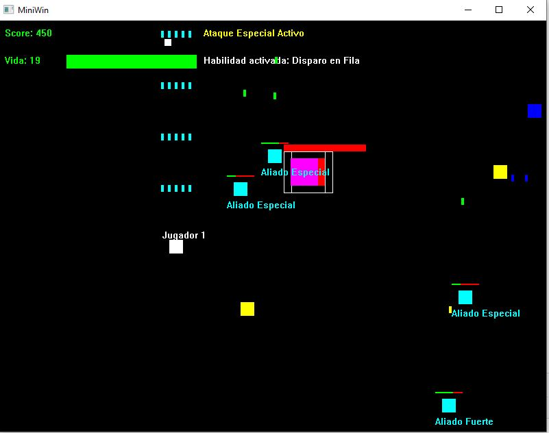
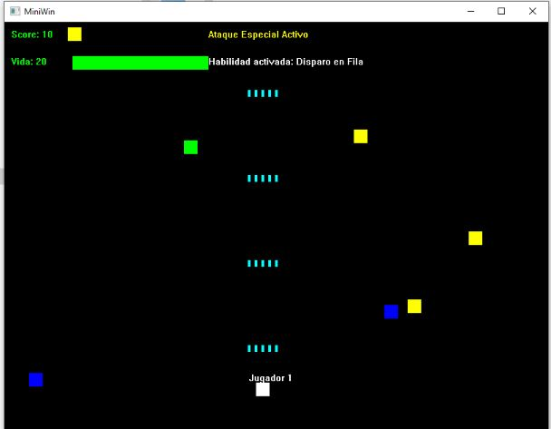
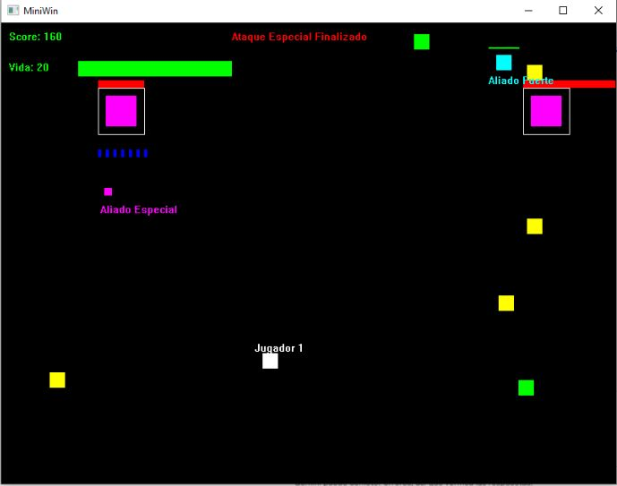
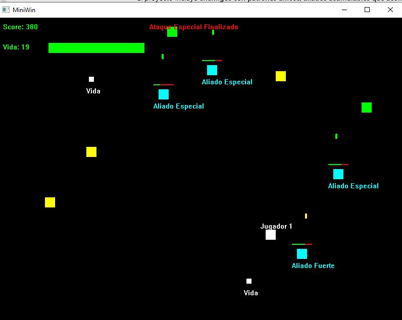

# 🎮 Space Invaders 2D — C++ Studio + Miniwin

**Resumen:**
Desarrollo de un **videojuego arcade retro 2D** inspirado en *Space Invaders*, implementado en **C++ con Miniwin**.
El proyecto incluye **enemigos con patrones únicos, aliados acumulables que acompañan al jugador, bosses desafiantes con múltiples fases y un sistema de cajas de apoyo dinámico**, logrando una experiencia arcade con **alta complejidad técnica y jugabilidad estratégica**.

**Tecnologías:** C++ · Miniwin · Programación orientada a objetos

---

## 🎥 Demo (capturas / gif)

---

## ✨ Características clave

### 🎮 Jugabilidad

* Control mediante **teclado**:

  * **Flechas** → movimiento lateral del jugador.
  * **1, 2, 3, 4** → activación de habilidades especiales.
* Sistema de **cooldown, energía y duración** para gestionar las habilidades.
* Posibilidad de acumular **aliados que siguen al jugador**, formando un escuadrón de ataque.

### 👾 Enemigos

* **Enemigos básicos:** bloques de colores con diferentes **velocidades y resistencia**.
* **Patrones de ataque únicos:** cada tipo de enemigo dispara de forma distinta (ráfagas, disparos diagonales, proyectiles lentos pero fuertes, etc.).
* **Enemigos avanzados:** incluyen esquivas o cambios de dirección impredecibles.
* **Bosses:**

  * Barra de vida extendida.
  * **Fases múltiples**: cambian de ataque al perder cierta cantidad de vida.
  * Proporcionan un reto estratégico al jugador.

### 🟪 Aliados y cajas de apoyo

* **Aliado Especial (morado):** aumenta la cadencia de disparo.
* **Aliado Fuerte (cian):** inflige más daño y tiene más resistencia.
* **Aliados acumulables:** el jugador puede tener varios aliados que lo siguen en formación.
* **Riesgo táctico:** los aliados pueden ser destruidos si un disparo enemigo los alcanza, obligando a protegerlos.
* **Cajas de apoyo** con recompensas al azar:

  * ❤️ Vida extra.
  * ✨ Nuevas habilidades desbloqueables.
  * 🤝 Más aliados para reforzar al jugador.

### 🔫 Sistema de ataques y habilidades

* **Disparo básico:** proyectiles azules estándar.
* **Disparo en Fila:** dispara múltiples proyectiles paralelos.
* **Otros ataques desbloqueables:** disparo diagonal, ráfagas rápidas, proyectiles potentes de baja velocidad.
* **Tiempo y estrategia:** cada habilidad tiene un cooldown o límite de energía.

### 🎨 Estilo gráfico retro

* Minimalista, con **bloques de colores sólidos sobre fondo negro**.
* UI clara con **Score, Vidas, Estado de habilidades y etiquetas de vida** para jugador, aliados, enemigos y bosses.

---

## 📖 Manual de Juego

### 🎮 Controles

| Tecla   | Acción                               |
| ------- | ------------------------------------ |
| ⬅️ / ➡️ | Mover al jugador (izquierda/derecha) |
| 1       | Activar **Disparo en Fila**          |
| 2       | Activar **Disparo Diagonal**         |
| 3       | Activar **Ráfaga Rápida**            |
| 4       | Activar **Proyectil Potente**        |
| Espacio | Disparo básico                       |

---

### 👾 Enemigos

| Tipo       | Color          | Patrón de ataque                             |
| ---------- | -------------- | -------------------------------------------- |
| Básico     | Amarillo       | Movimiento simple, disparo lento             |
| Ágil       | Azul           | Mayor velocidad, disparo en ráfagas          |
| Resistente | Verde          | Más vida, proyectiles potentes               |
| Boss       | Rojo/Combinado | Varias fases, cambia de patrón según su vida |

---

### 🟪 Aliados

| Tipo            | Color  | Habilidad                               |
| --------------- | ------ | --------------------------------------- |
| Aliado Especial | Morado | Incrementa cadencia de disparo          |
| Aliado Fuerte   | Cian   | Aumenta daño y resistencia              |
| Acumulables     | —      | Siguen al jugador formando un escuadrón |
| Vulnerables     | —      | Si reciben disparos enemigos, mueren    |

---

### 📦 Cajas de apoyo

| Caja     | Recompensa                   |
| -------- | ---------------------------- |
| ❤️ Roja  | Vida extra                   |
| ✨ Dorada | Nueva habilidad desbloqueada |
| 🤝 Verde | Aliado adicional             |

---

### 🔫 Habilidades

| Habilidad         | Tecla   | Descripción                             |
| ----------------- | ------- | --------------------------------------- |
| Disparo básico    | Espacio | Proyectiles simples                     |
| Disparo en Fila   | 1       | Dispara múltiples proyectiles paralelos |
| Disparo Diagonal  | 2       | Lanza proyectiles en ángulos opuestos   |
| Ráfaga rápida     | 3       | Disparo continuo de alta velocidad      |
| Proyectil potente | 4       | Disparo lento pero con gran daño        |

---

## 📦 Estado del Proyecto

✅ **Disponible para interactuar en el ejecutable (.exe)**
El juego puede probarse directamente descargando el archivo compilado para Windows.

📥 **[Descargar Space Invaders 2D (.exe)](Space_Invaders.exe)**

---

## 📂 Estructura del repo

* `assets/` → Capturas y GIFs de demostración.

---
## 🔒 Código

El proyecto completo (código en C++, lógica de juego y assets) está en un **repositorio privado** por motivos de propiedad intelectual.

**Acceso al código:** disponible bajo solicitud (puedo invitarte a ver el repo privado).

---

## 📬 Contacto / CV

Si quieres revisar el código o una demo privada, escríbeme a: **[tu.email@ejemplo.com](mailto:tu.email@ejemplo.com)**

---
